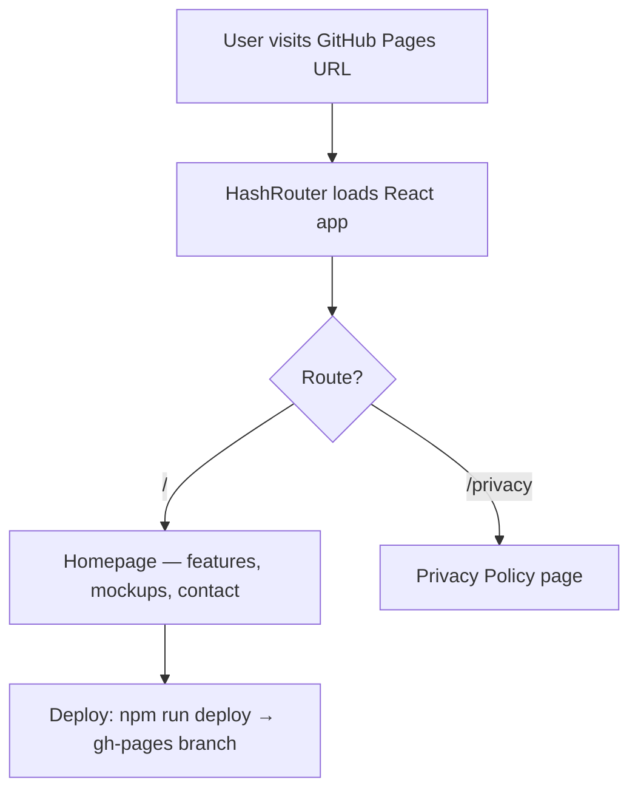

# ZenZone Website

 

## Overview

Marketing landing pages for iOS apps have no default home — developers need to build and host one to publish to the App Store. ZenZone-Website is a React single-page application that serves as the public landing page for the ZenZone iOS productivity app, showcasing features, app mockups, and a privacy policy. It is intended for prospective ZenZone users and Apple's App Store review team.

## Getting Started

### Prerequisites

- [Node.js](https://nodejs.org/) (v18 or later recommended)
- [npm](https://docs.npmjs.com/downloading-and-installing-node-js-and-npm) (bundled with Node.js)

### Installation

```sh
$ git clone https://github.com/Harvey-Mackie/FocusZone-Website.git
$ cd FocusZone-Website
$ npm install
```

### Usage

**Start the development server:**

```sh
$ npm start
// Opens http://localhost:3000 in your browser
```

**Run tests:**

```sh
$ npm test
// Launches the test runner in interactive watch mode
```

**Deploy to GitHub Pages:**

```sh
$ npm run deploy
// Builds the app and pushes to the gh-pages branch
```

## Structure

```sh
FocusZone-Website/
├── 📁 public/          # Static assets served as-is (HTML template, icons, manifest)
├── 📁 src/             # React source code
│   ├── App.js          # Main application component (homepage)
│   ├── App.css         # Homepage styles
│   ├── Privacy.js      # Privacy policy page
│   ├── index.js        # React entry point
│   └── 📁 images/      # App mockup screenshots
├── package.json        # Dependencies and npm scripts
└── .gitignore
```

## How It Works



## References

- [Create React App documentation](https://create-react-app.dev/)
- [React Router](https://reactrouter.com/)
- [gh-pages — GitHub Pages deployment tool](https://github.com/tschaub/gh-pages)
